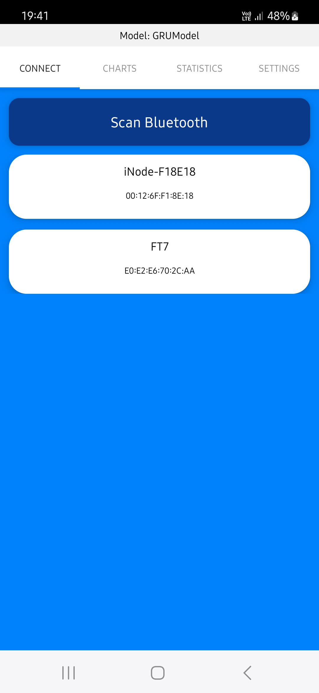
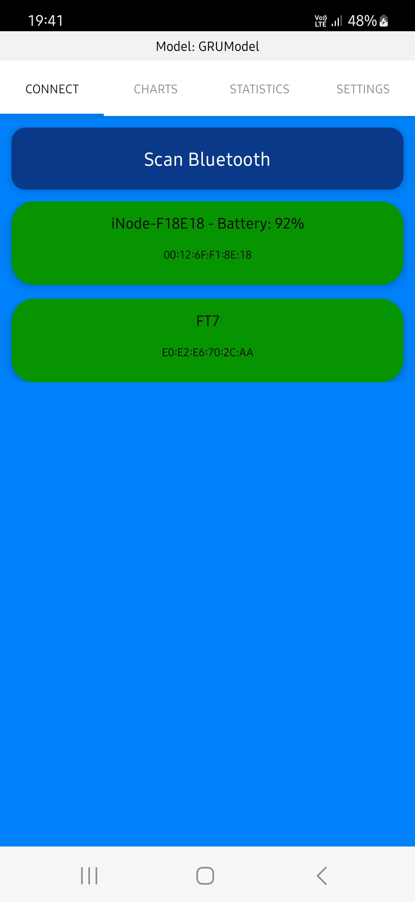
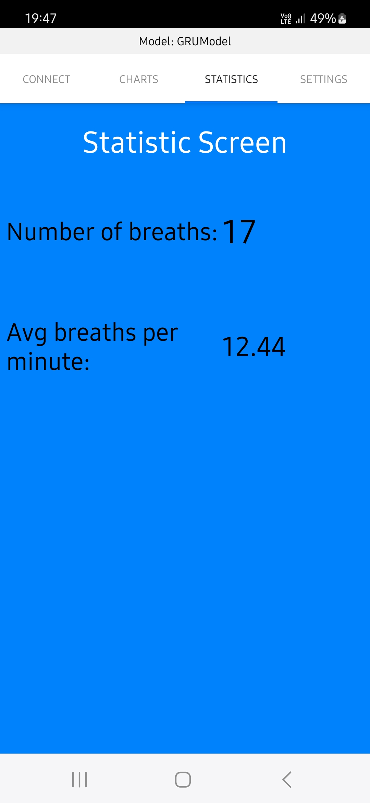
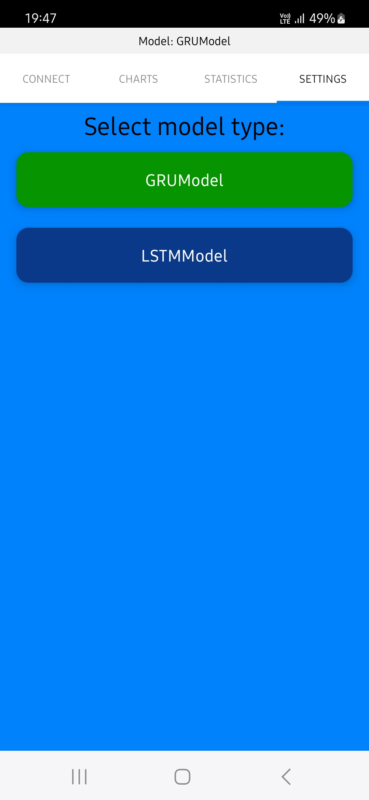

# BrpApp

Android application for Breath Research Project.

## Description

This application is part of the Breath Research Project, which aims to develop a system for monitoring and analyzing the breathing of users using a smartphone connected to a wearable device via Bluetooth. The application is responsible for collecting data from the wearable device and processing it using Machine Learning models to provide information about the user's state of breath.

The source files in this repository have been created using React Native framework and Node.js. The application is designed to run on Android devices with version 11 or higher. Below is a detailed description of the repository structure and the role of each folder and file.

## Requirements

- Node.js
- React Native CLI
- Android Studio
- Android SDK
- Java Development Kit (JDK)
- Android Device or Emulator (Android 11.0 or higher)

## How to run?

1. Run `npm install` to install all dependencies.

2. Run `npm run android` to run the application on an Android device in development mode.

3. Run `npm run androidrel` to build the application in release mode.

## Repository Structure

- **`android`**  
  Contains files necessary for building the application on the Android platform. Key subdirectories include:
  - **`android/app/src/main/assets`**  
    This folder contains pre-trained models in the `tflite` format, used by the application for data processing.
  - **`android/app/src/main/java/com/brpapp/`**  
    Contains native Java code responsible for loading models at application startup and integration with the Android platform.

- **`src`**  
  Contains the application's source code, written in TypeScript using the React Native framework. This directory includes the app's logic, state management, and user interface components.

- **`src/screens`**  
  This folder holds source files for the various screens of the application. Key screens include:
  - **`src/screens/ChartsScreen.tsx`**  
    Handles data reception from devices, processing via the model, and generating charts. It also facilitates saving recordings to a file.
  - **`src/screens/ConnectScreen.tsx`**  
    Manages connections to Bluetooth (BLE) devices. To extend support for additional sensors, the device’s BLE service and characteristic addresses, as well as the device name, must be specified. This also requires adding an algorithm for reading raw byte data and converting it into appropriate values.
  - **`src/screens/SettingsScreen.tsx`**  
    A settings screen where users can select the currently used neural network model. Currently available models include LSTM and GRU.
  - **`src/screens/StatisticScreen.tsx`**  
    Displays statistics about the number of completed breathing cycles and their average rate per minute.

## Gallery

    

        
        
Connection screen before connecting to any device

    

    

        
        
Connection screen after connecting

    

    

        
        
Graph screen

    

    

        
        
Statistics screen

    

    

        
        
Settings screen

    

## Authors

- **[Damian Jankowski](https://github.com/pingwin02)**
- **[Kacper Karski](https://github.com/JaKarski)**
- **[Filip Krawczak](https://github.com/prosto20025)**
- **[Maciej Szefler](https://github.com/rysiekpol)**

## License

This project is licensed under the MIT License - see the [LICENSE](license) file for details.
