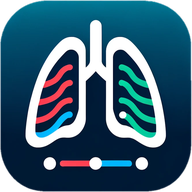
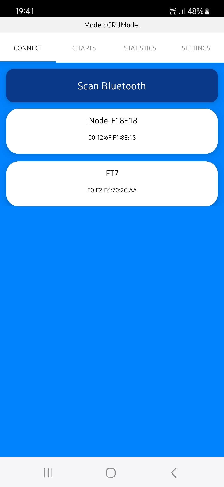
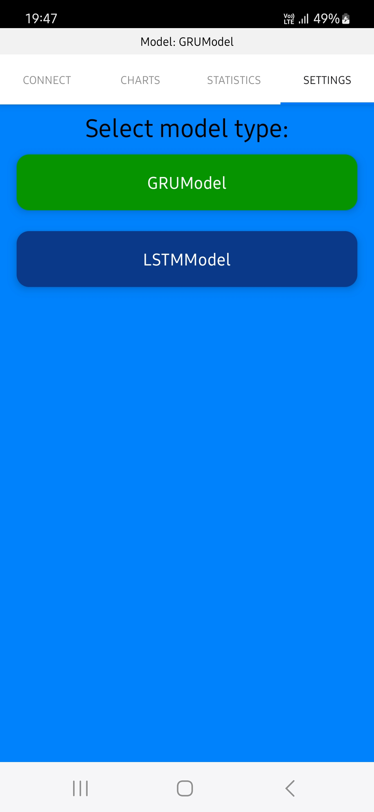

# BrpApp

Android application for Breath Research Project.

## Description

This application is part of the Breath Research Project, which aims to develop a system for monitoring and analyzing the breathing of user using a smartphone connected to a wearable device via Bluetooth. The application is responsible for collecting data from the wearable device and processing it using Machine Learning models to provide information about the user's state of breath.

## Requirements

- Node.js
- React Native CLI
- Android Studio
- Android SDK
- Java Development Kit (JDK)
- Android Device or Emulator (Android 11.0 or higher)

## How to run?

1. Run `npm install` to install all dependencies.

2. Run `npm run android` to run the application on an Android device in development mode.

3. Run `npm run androidrel` to build the application in release mode.

## Gallery

    

        
        
Connection screen before connecting to any device

    

    

        
        
Connection screen after connecting

    

    

        
        
Graph screen

    

    

        
        
Statistics screen

    

    

        
        
Settings screen

    

## Authors

- **[Damian Jankowski](https://github.com/pingwin02)**
- **[Kacper Karski](https://github.com/JaKarski)**
- **[Filip Krawczak](https://github.com/prosto20025)**
- **[Maciej Szefler](https://github.com/rysiekpol)**

## License

This project is licensed under the MIT License - see the [LICENSE](license) file for details.
